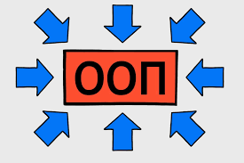

# karusel

[Ссылка на проект](https://pavelcydep.github.io/karusel/)

## Стек:

## Инструкции по запуску:
- клонировать репозиторий
- открыть index.html
## Планы по улучшению:
-Улучшить адаптивность
